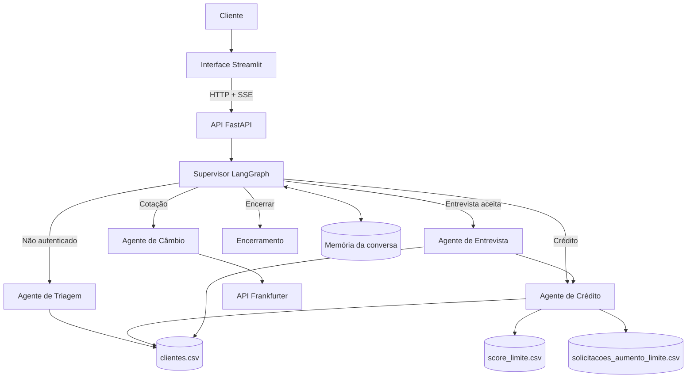

# Banco Ágil — Agente Bancário Inteligente

Sistema de atendimento bancário conversacional com interface em Streamlit e
backend construído com FastAPI, LangChain e LangGraph. A aplicação utiliza
agentes de IA especializados para autenticação, operações de crédito,
entrevista financeira e consulta de câmbio, mantendo para o cliente a
experiência de uma única conversa.

## Visão geral

O projeto simula o atendimento do banco digital fictício Banco Ágil. Antes de
acessar qualquer serviço, o cliente é autenticado por CPF e data de nascimento.
Depois disso, um supervisor interno identifica a intenção da mensagem e
encaminha o fluxo para o especialista adequado.

O estado de cada conversa é mantido em memória pelo LangGraph e identificado
por um `thread_id`. Os dados bancários usados no desafio são armazenados em
arquivos CSV.

A interface oferece uma experiência de chat com respostas transmitidas em
tempo real, identidade visual roxa do Banco Ágil e opção para iniciar um novo
atendimento. Na primeira interação, a assistente virtual se apresenta ao
cliente como Lia.

## Funcionalidades implementadas

- Autenticação por CPF e data de nascimento;
- Bloqueio do atendimento após três falhas consecutivas de autenticação;
- Consulta do limite de crédito atual;
- Solicitação e avaliação de aumento de limite;
- Registro das solicitações em `solicitacoes_aumento_limite.csv`;
- Aprovação ou rejeição conforme a faixa do score em `score_limite.csv`;
- Entrevista financeira estruturada para recalcular o score;
- Atualização de score e limite no cadastro do cliente;
- Consulta de moedas em tempo real pela API Frankfurter;
- Encerramento da conversa a qualquer momento;
- Memória de conversa em processo, isolada por `thread_id`;
- Tratamento controlado de entradas inválidas, arquivos indisponíveis e falhas
  em serviços externos;
- Proteção para impedir que um agente opere sobre CPF diferente do cliente
  autenticado;
- API documentada automaticamente com Swagger e OpenAPI;
- Interface de chat em Streamlit;
- Streaming das respostas por Server-Sent Events (SSE);
- Testes unitários e de integração.

## Arquitetura do sistema



### Agentes

#### Agente de Triagem

Recepciona o cliente, solicita primeiro o CPF e depois a data de nascimento.
Os dados são validados contra `clientes.csv`. Depois de três falhas
consecutivas, o atendimento é encerrado por segurança.

#### Agente de Crédito

Consulta o limite atual e processa pedidos de aumento. O novo limite solicitado
é comparado ao limite máximo permitido para o score do cliente. O resultado é
registrado como `pendente`, `aprovado` ou `rejeitado`.

Quando o pedido é rejeitado, o cliente pode aceitar uma entrevista financeira
para recalcular o score.

#### Agente de Entrevista de Crédito

Coleta, uma pergunta por vez:

1. Renda mensal;
2. Tipo de emprego;
3. Despesas fixas mensais;
4. Número de dependentes;
5. Existência de dívidas ativas.

O novo score é limitado ao intervalo de 0 a 1000, atualizado em `clientes.csv`
e o atendimento retorna ao fluxo de crédito.

#### Agente de Câmbio

Identifica os códigos das moedas, consulta a taxa atual na API Frankfurter e
apresenta o resultado sem inventar ou estimar valores. Uma consulta bem-sucedida
encerra o atendimento de câmbio com uma mensagem amigável.

### Grafo e memória

O LangGraph controla o roteamento e o estado compartilhado entre os agentes.
Cada conversa recebe um `thread_id`, usado pelo checkpointer em memória para
separar mensagens, autenticação, agente atual, tentativas e resultados das
operações. O estado é reiniciado quando a API é encerrada.

### Organização do código

```text
backend/
├── app/
│   ├── agents/              # Criação dos quatro agentes
│   ├── api/                 # Rotas e schemas da API
│   ├── config/              # Configurações de ambiente
│   ├── core/                # Logging, contexto e regras transversais
│   ├── graph/               # Estado, nós, rotas e construção do LangGraph
│   ├── llm/                 # Configuração do modelo Groq
│   ├── models/              # Modelos de domínio
│   ├── prompts/             # Instruções e limites dos agentes
│   ├── repositories/        # Leitura e escrita dos CSVs
│   ├── services/            # Regras de negócio
│   └── tools/               # Ferramentas disponíveis aos agentes
├── data/                    # Bases CSV do desafio
└── tests/                   # Testes unitários e de integração

frontend/
├── app.py                   # Interface e estado visual do chat
├── api_client.py            # Cliente HTTP e parser de eventos SSE
├── .streamlit/config.toml   # Tema visual da aplicação
├── Dockerfile
└── tests/                   # Testes do protocolo de streaming
```

## Manipulação dos dados

### `clientes.csv`

Contém CPF, nome, nascimento, score e limite atual. O score pode ser atualizado
pela entrevista e o limite pode ser atualizado após uma aprovação.

### `score_limite.csv`

Relaciona faixas de score ao maior limite de crédito permitido.

### `solicitacoes_aumento_limite.csv`

Registra cada solicitação com as colunas:

```text
cpf_cliente,data_hora_solicitacao,limite_atual,
novo_limite_solicitado,status_pedido
```

As gravações usam timestamp ISO 8601 e valores monetários com duas casas
decimais.

## Fórmula do score

O cálculo segue a fórmula ponderada sugerida no desafio:

```text
score =
    (renda_mensal / (despesas_fixas + 1)) * 30
    + peso_emprego
    + peso_dependentes
    + peso_dividas
```

Pesos utilizados:

| Critério | Peso |
|---|---:|
| Emprego formal | 300 |
| Autônomo | 200 |
| Desempregado | 0 |
| Nenhum dependente | 100 |
| Um dependente | 80 |
| Dois dependentes | 60 |
| Três ou mais dependentes | 30 |
| Possui dívidas | -100 |
| Não possui dívidas | 100 |

O resultado final é arredondado e limitado entre 0 e 1000.

## Escolhas técnicas e justificativas

- **FastAPI:** validação dos contratos, suporte assíncrono e documentação
  automática da API;
- **LangGraph:** estado explícito e roteamento controlado entre especialistas;
- **LangChain:** criação dos agentes e integração com ferramentas;
- **Groq:** execução do modelo de linguagem com baixa latência;
- **Pydantic:** validação das entradas da API e modelos de domínio;
- **CSV:** formato solicitado pelo desafio e simples de inspecionar durante a
  avaliação;
- **Docker Compose:** ambiente reproduzível para API e interface;
- **Streamlit:** interface simples para testar todo o atendimento com pouco
  acoplamento ao backend;
- **SSE:** transmissão progressiva das respostas usando HTTP padrão, sem
  expor o roteamento interno dos agentes.

O roteamento possui regras determinísticas que impedem o modelo de ignorar a
autenticação. As ferramentas de dados também validam o CPF contra o contexto
autenticado, evitando acesso cruzado entre clientes.

## Desafios enfrentados

### Continuidade entre agentes

O histórico, a autenticação e os resultados precisam sobreviver às transições.
Isso foi resolvido com um estado tipado no LangGraph e checkpoints associados a
um `thread_id`.

### Separação das conversas

O `thread_id` separa o estado de cada atendimento na memória do processo. Na
interface, o botão **Nova conversa** limpa o histórico visual e inicia um novo
identificador, sem reaproveitar a autenticação anterior.

### Segurança das operações

Não é suficiente confiar no CPF escolhido pelo modelo. Um contexto por execução
confere se o CPF recebido pela ferramenta é o mesmo que foi autenticado antes
de consultar ou alterar dados.

### Falhas externas e entradas inválidas

Ferramentas e serviços convertem falhas esperadas em respostas controladas. A
API de câmbio possui timeout e trata moedas inválidas, indisponibilidade e erros
HTTP sem inventar uma cotação.

## Pré-requisitos

Para a execução recomendada com Docker:

- Docker;
- Docker Compose;
- Uma chave válida da API Groq.

Para execução local sem container:

- Python 3.12 ou superior;
- Uma chave válida da API Groq.

## Configuração

Crie o arquivo de ambiente a partir do exemplo:

```bash
cp backend/.env.example backend/.env
```

Edite `backend/.env` e informe sua chave:

```env
GROQ_API_KEY=sua_chave_da_groq
```

Principais configurações disponíveis:

| Variável | Padrão | Descrição |
|---|---|---|
| `GROQ_MODEL` | `openai/gpt-oss-120b` | Modelo utilizado pelos agentes |
| `FRONTEND_URL` | `http://localhost:8501` | Origem permitida pelo CORS |

O `.env` está no `.gitignore` e não deve ser enviado ao repositório.

## Execução com Docker

Na raiz do projeto, execute:

```bash
docker compose up --build -d
```

Verifique os containers:

```bash
docker compose ps
```

Para acompanhar os logs:

```bash
docker compose logs -f backend
```

Para encerrar:

```bash
docker compose down
```

Após a inicialização, acesse:

- Interface: [http://localhost:8501](http://localhost:8501)
- API: [http://localhost:8000](http://localhost:8000)
- Swagger: [http://localhost:8000/docs](http://localhost:8000/docs)

## Execução local

Crie e ative o ambiente virtual:

```bash
python -m venv .venv
source .venv/bin/activate
pip install -r backend/requirements.txt
pip install -r frontend/requirements.txt
```

Inicie a API:

```bash
cd backend
uvicorn app.main:app --reload
```

Em outro terminal, inicie a interface:

```bash
cd frontend
streamlit run app.py
```

## Endpoints

| Método | Caminho | Descrição |
|---|---|---|
| `POST` | `/api/v1/chat/stream` | Envia uma mensagem e transmite a resposta em eventos SSE |
| `GET` | `/docs` | Swagger UI |
| `GET` | `/redoc` | Documentação ReDoc |

### Exemplo de conversa pela API

Primeira mensagem:

```bash
curl -N -X POST http://localhost:8000/api/v1/chat/stream \
  -H "Content-Type: application/json" \
  -d '{"message":"Olá"}'
```

A resposta é transmitida como eventos SSE. O evento `metadata` traz o
`thread_id` da conversa, `token` traz cada trecho da resposta e `final` traz a
mensagem completa:

```text
event: metadata
data: {"thread_id": "identificador-da-conversa"}

event: token
data: {"content": "Olá! Por favor, informe seu CPF."}

event: final
data: {"message": "Olá! Por favor, informe seu CPF.", "thread_id": "identificador-da-conversa", "finished": false, "current_agent": "triage"}
```

Reutilize o `thread_id` recebido nas próximas mensagens:

```bash
curl -N -X POST http://localhost:8000/api/v1/chat/stream \
  -H "Content-Type: application/json" \
  -d '{
    "message":"11111111111",
    "thread_id":"identificador-da-conversa"
  }'
```

## Clientes fictícios para demonstração

| CPF | Data de nascimento | Score | Limite inicial |
|---|---|---:|---:|
| `11111111111` | `15/05/1990` | 500 | R$ 1.200,00 |
| `22222222222` | `20/10/1985` | 720 | R$ 4.500,00 |
| `33333333333` | `10/02/1998` | 880 | R$ 9.000,00 |

Todos os registros são fictícios e existem apenas para demonstrar o desafio.

## Testes

Com o ambiente virtual ativado, execute na raiz do projeto:

```bash
PYTHONPATH=backend python -m pytest -q backend/tests
```

A suíte cobre serviços de autenticação, crédito e score, repositórios CSV,
autorização por CPF, construção do grafo, configuração da memória e fluxos de
encerramento.

Execute também os testes da interface:

```bash
PYTHONPATH=frontend python -m pytest -q frontend/tests
```

Eles validam a interpretação dos eventos SSE consumidos pelo Streamlit.

## Observações

- Os CSVs são adequados ao escopo do desafio e à execução com uma instância da
  API. Em um ambiente bancário real, seriam substituídos por um banco de dados
  transacional;
- A memória conversacional é temporária e é apagada quando a API é reiniciada;
- Nunca envie `backend/.env`, caches do Python ou credenciais para o
  repositório.
